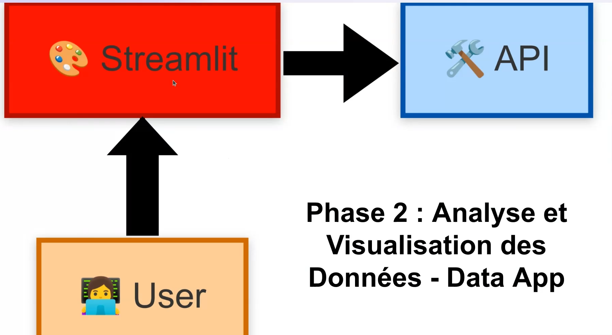

# Implementation of a data structuring architecture to exploit and enhance cinema data: from database design to interactive web app.

## 🎯 Business issues
- **Structuration of cinema data.**
- **Understanding users preferences about movies.**
- **Finding top rated films among users.**
- **Characterising top rated films through their tags.**
- **Building interactive web app to facilitate visualization of business information.**

**🏗️ Key steps**

**First steps :**
- Design of an SQLite database to centralise raw CSV data from various sources.
- Development of an SQLAlchemy layer to connect to the SQLite database securely from python.

**Next steps :**
- Building a secure, documented REST API with FastAPI, containerised with Docker and deployed in the cloud (Render) to facilitate access to data for other services and applications.
- Implementation of a Python package in the form of a Python SDK to connect to the API followed by published on PyPI.
- Creation of an interactive Streamlit application connected to the API to make it easier to view data to respond to business use cases.

**📊 Dataset**
- **Source** : [Datasets](https://grouplens.org/datasets/movielens/)
- **Tables** :
   - **Movies**
   - **Ratings**
   - **Tags**
   - **Links**

**📦 Deliverables**
- A SQLite database storing structured data.
- A FastAPI endpoint exposing data as a service.
- A python SDK that allow connexion to the API.
- A streamlite web app for interactive visualisation and reporting.

**🛠️ Stack (Tools)**

1. **Python**
2. **SQLite**
3. **SQLAlchemy**
4. **FastAPI**
5. **Python SDK**
6. **Docker**
7. **Git**
8. **GitHub**
9. **Render**
10. **PyPI**

